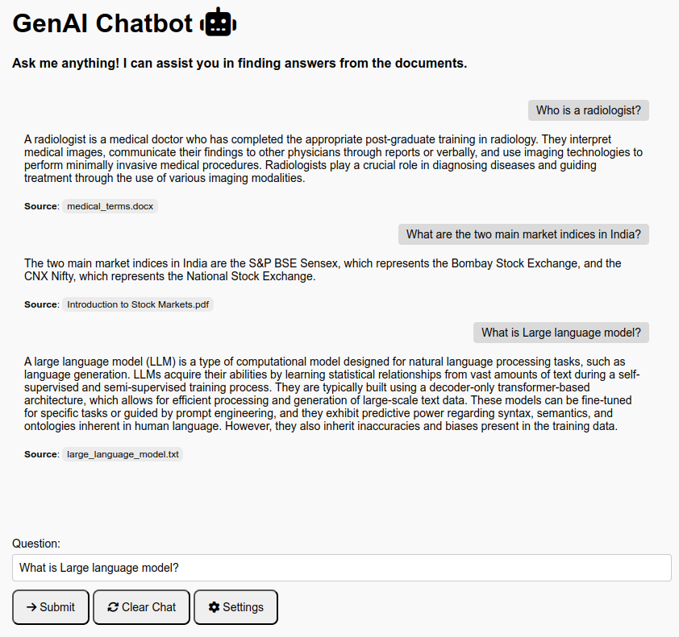

## 🤖 GenAI Chat
GenAI Chat is an intelligent question-answering chatbot designed to help users interact with their data. Built on the Retrieval Augmented Generation (RAG) technique, it leverages the power of OpenAI’s large language models (LLMs) and Redis vector databases to provide accurate and context-aware answers to complex user queries.



Key Features:
- Dynamic Knowledge Retrieval: It retrieve relevant documents from Redis Vector databases in real time, allowing them to respond with up-to-date and contextually accurate information.
- Natural language understanding: It utilizes Large language models (LLMs). LLMs can analyze complex patterns in language and can accurately interpret subtle meanings, respond appropriately to diverse queries, and adapt to various conversational styles, significantly enhancing the quality of human-computer communication.
- Multiple File Support: Project currently supports `.txt`, `.pdf` and `.docx` file formats (Support for `.pptx`, `.csv`, `.xlsx` and `.json` files will be coming in next release).
- Multiple Data Source Support: Project supports 3 different sources for document indexing Local, `Azure` and `AWS`.

Technology Used:

[](https://skillicons.dev)

For more detailed explanation of this project, including its design and implementation, check out the accompanying [Medium blog post](https://medium.com/).

## 🔎 System Architecture

The chatbot consists of these core components:

- **Frontend**: Takes user queries and sends them to the backend. It's built with HTML + JavaScript and is running in a **Docker** container with **Nginx**.
- **Backend:** Takes user queries, fetches relevant documents from Redis Vector DB, builds prompts, and sends them to the LLM for generating response. Its built with **Flask** and is running in a **Docker** container.
- **Redis Vector Database:** Stores the document text, embedding vectors and session data. It’s also running in a **Docker** container.
- **OpenAI LLM**: Takes prompt and generates response. We will be using `gpt-4o` model for generating response and `text-embedding-3-small` model for generating embedding vectors (embedding dimension 1536). These models are hosted in cloud Chatbot makes API call in order to communicate with the models. These models can be updated in `backend/common/config.py`.


## 🛠️ Installation 

Follow below steps in either on Mac and Linux (Ubuntu) machine.

**Step 1**: Install [Docker](https://www.docker.com/get-started/)

**Step 2**: Clone the repository
```
$ git clone https://github.com/your-repo
```

**Step 3**: Configure OpenAI credentials

1. Login to [OpenAI](https://platform.openai.com)
2. In the upper right corner of the page, choose `Your profile`.
3. Create `API keys`.
4. Configure OpenAI key in `GenAI-Chat/.env` environment file as follows.

```
OPENAI_API_KEY=key
```

**Step 4**: Download the `model.safetensors` file from this [link](https://www.dropbox.com/scl/fi/310abl0pqs0hcxmqmiz70/model.safetensors?rlkey=yadhs2nemgt2lsighd1oufd2g&st=d9txrq8d&dl=0) and place it in the `backend/model` directory.

**Step 5**: Build Images and Run Containers

```
$ cd GenAI-Chat
$ ./deploy.sh
```

> Note: While building the image genai-chat-backend the installation of torch library might take some time depending on the internet connection speed.

**Step 6**: Index the data into Redis by following the instructions provided in the [README.md](/data_indexing/README.md) file.

**Step 7**: Once indexing is complete, you can interact with the frontend by visiting http://localhost:8080/.

> Note: RedisInsight can be accessed at http://localhost:8001/

## ⭐ Support and Contributions

If you found this repository helpful, please consider giving it a **star** ⭐ to show your support! It helps others discover the project and keeps me motivated to improve it further. If you'd like to support my work even more, consider buying me a coffee.

<a href='https://ko-fi.com/J3J4196KY7' target='_blank'></a>

### 🐛 Found a Bug?  
If you encounter any issues, please [open an issue](https://github.com/atinesh-s/GenAI-Chat/issues) with detailed steps to reproduce the problem. I’ll look into it as soon as possible.

### 💡 Have a Feature Request?  
I’m always looking to improve this project! If you have suggestions for new features or enhancements, feel free to [submit a feature request](https://github.com/atinesh-s/GenAI-Chat/issues).

---

Thank you for your support and contributions! 🙌

## 📝 License

This project is licensed under the `GNU General Public License v3.0`. See the [LICENSE](LICENSE) file for more details.