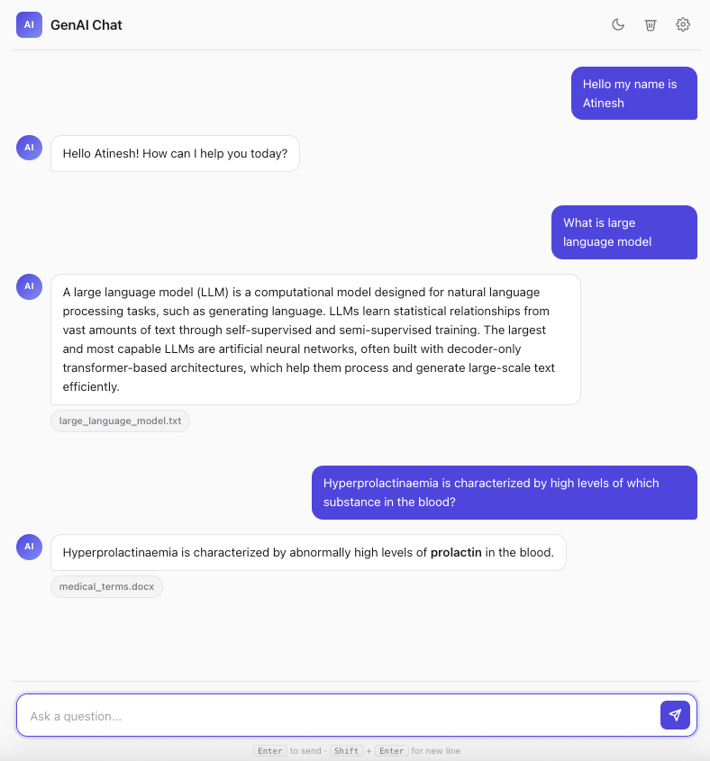
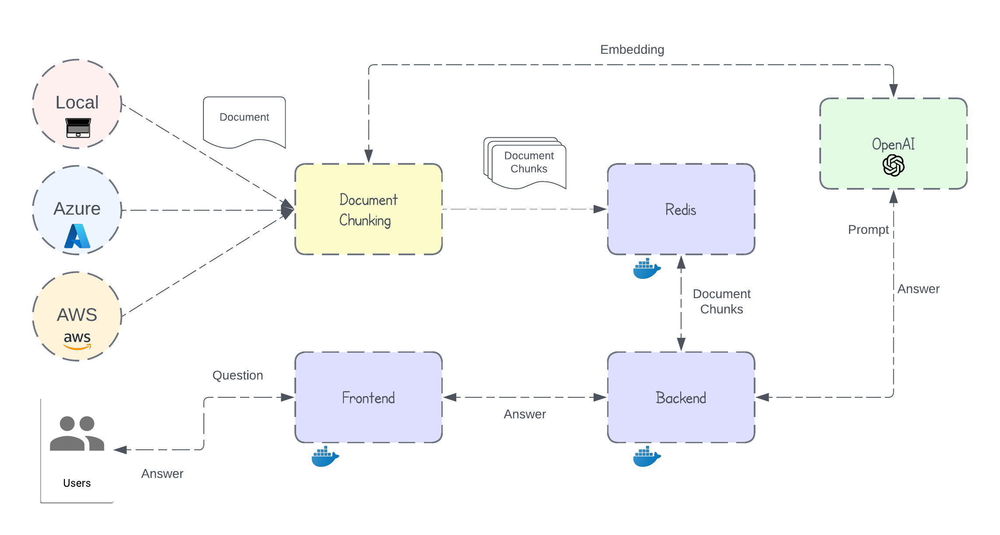
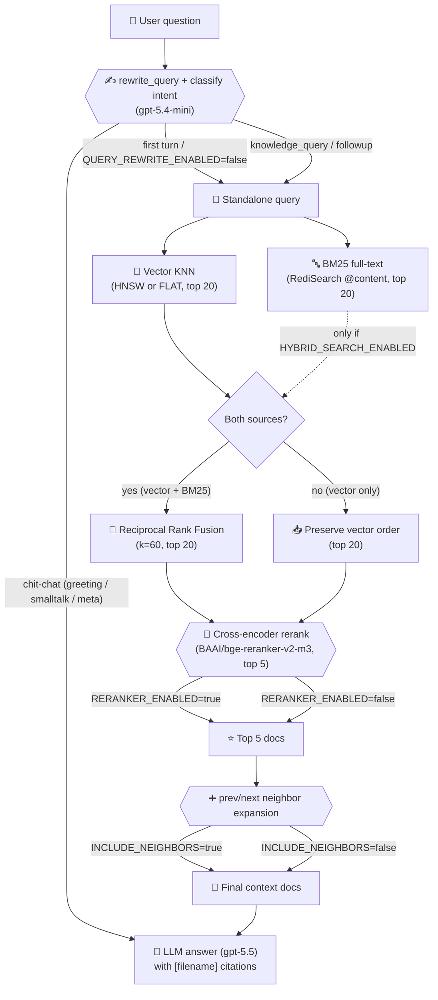

## 🤖 GenAI Chat
GenAI Chat is an intelligent question-answering chatbot designed to help users interact with their data. Built on the Retrieval Augmented Generation (RAG) technique, it leverages the power of OpenAI’s large language models (LLMs) and Redis vector databases to provide accurate and context-aware answers to complex user queries.



Key Features:
- **Advanced RAG pipeline**: Standalone-query rewriting + intent classification → hybrid retrieval (vector + BM25) → Reciprocal Rank Fusion → cross-encoder reranking (`BAAI/bge-reranker-v2-m3`).
- **Intent classification**: Skips retrieval for chit-chat turns (greetings, thanks, meta) to save latency and tokens.
- **Structure-aware chunking**: Per-format splitters that preserve headings (PDF/Markdown/DOCX), schema (CSV/XLSX), and JSON structure.
- **Dynamic knowledge retrieval** from Redis Stack with HNSW or FLAT indexes.
- **Multi-format support**: `.txt`, `.md`, `.pdf`, `.docx`, `.json`, `.csv`, `.xlsx`.
- **Multi-source indexing**: `Local`, `Azure Blob`, `AWS S3`.

Technology Used:

[](https://skillicons.dev)

For more detailed explanation of this project, including its design and implementation, check out the accompanying [Medium blog post](https://atinesh.medium.com/building-a-retrieval-augmented-generation-rag-chatbot-9a86c5b05691).


## 🚀 Updates
- **[23-05-2026]**: `v1.3` — Advanced RAG release:
  - Hybrid search (vector KNN + BM25) fused with **Reciprocal Rank Fusion (k=60)**.
  - Cross-encoder reranker `BAAI/bge-reranker-v2-m3`.
  - Standalone-query rewriter + intent classifier (skips retrieval for chit-chat).
  - Structure-aware chunking.
- **[11-05-2025]**: Added support for HNSW (Hierarchical Navigable Small World) Redis vector indexing and new improved user interface.
- **[11-03-2025]**: Added support for `.json`, `.csv` and `.xlsx` files.
- **[19-01-2025]**: Initial release of GenAI-Chat `v1.0`.

## 🔎 System Architecture

The chatbot consists of these core components:

- **Frontend**: Takes user queries and sends them to the backend. It's built with HTML + JavaScript and is running in a **Docker** container with **Nginx**.
- **Backend:** Takes user queries, runs the advanced RAG pipeline (query rewrite + intent classify → hybrid retrieve → RRF → rerank), builds prompts, and sends them to the LLM. Built with **Flask** and runs in a **Docker** container.
- **Redis Stack:** Stores document text, embedding vectors and session data. Provides both vector KNN (HNSW/FLAT) and full-text BM25 search. Runs in a **Docker** container.
- **OpenAI LLM**: `gpt-5.5` for answer generation, `gpt-5.4-mini` for cheap query rewriting + intent classification, and `text-embedding-3-large` (3072-d) for embeddings. Configurable in `backend/config.py`.
- **HuggingFace Inference API**: Hosts the cross-encoder reranker `BAAI/bge-reranker-v2-m3`.



### 🧪 Retrieval pipeline


```mermaid
flowchart TD
    Q["🙋 User question"] --> RW{{"✍️ rewrite_query + classify intent<br/>(gpt-5.4-mini)"}}
    RW -- "chit-chat (greeting / smalltalk / meta)" --> LLM
    RW -- "first turn / QUERY_REWRITE_ENABLED=false" --> SQ["📝 Standalone query"]
    RW -- "knowledge_query / followup" --> SQ

    SQ --> VEC["🧭 Vector KNN<br/>(HNSW or FLAT, top 20)"]
    SQ --> BM["🔤 BM25 full-text<br/>(RediSearch @content, top 20)"]

    VEC --> FUSE{"Both sources?"}
    BM  -. "only if HYBRID_SEARCH_ENABLED" .-> FUSE

    FUSE -- "yes (vector + BM25)" --> RRF["🔀 Reciprocal Rank Fusion<br/>(k=60, top 20)"]
    FUSE -- "no (vector only)"    --> SINGLE["📥 Preserve vector order<br/>(top 20)"]

    RRF    --> RR{{"🎯 Cross-encoder rerank<br/>(BAAI/bge-reranker-v2-m3, top 5)"}}
    SINGLE --> RR

    RR -- "RERANKER_ENABLED=true"  --> TOP["⭐ Top 5 docs"]
    RR -- "RERANKER_ENABLED=false" --> TOP

    TOP --> NB{{"➕ prev/next neighbor expansion"}}
    NB -- "INCLUDE_NEIGHBORS=true"  --> CTX["📄 Final context docs"]
    NB -- "INCLUDE_NEIGHBORS=false" --> CTX

    CTX --> LLM["🤖 LLM answer (gpt-5.5)<br/>with [filename] citations"]
```

## 🛠️ Installation 

Follow below steps in either on Mac and Linux (Ubuntu) machine.

**Step 1**: Install [Docker](https://www.docker.com/get-started/)

**Step 2**: Clone the repository
```
$ git clone https://github.com/atinesh/GenAI-Chat.git
```

**Step 3**: Configure environment

```
$ cp .env.example .env
# then edit .env and fill in real values
```

Required:
- `OPENAI_API_KEY` — from [OpenAI](https://platform.openai.com) → *Your profile* → *API keys*.
- `HF_TOKEN` — from [HuggingFace Settings → Access Tokens](https://huggingface.co/settings/tokens)

Optional (only if you index from cloud storage):
- `AZURE_STORAGE_CONNECTION_STRING` — for indexing Azure Blob containers.
- `AWS_ACCESS_KEY_ID` / `AWS_SECRET_ACCESS_KEY` / `AWS_DEFAULT_REGION` — for indexing S3 buckets.

**Step 4**: Choose your vector index type

Set `INDEX_TYPE` in `.env` (defaults to `HNSW`):
- `FLAT` — best for small datasets (< 1M vectors) when accuracy matters more than latency.
- `HNSW` — best for larger datasets when speed/scalability matters more than exact recall.

> Note: For `HNSW` you can tune `EF_RUNTIME` in `.env`. Higher values increase recall but also latency. The default `64` is sized for `VECTOR_TOP_K=20`; raise it if you raise top-k.

**Step 5**: Build Images and Run Containers

```
$ cd GenAI-Chat
$ ./deploy.sh
```

> Note: Redis persistence is handled by a named Docker volume (`redis-data`), created automatically on first run.

**Step 6**: Index the data into Redis by following the instructions provided in the [README.md](/data_indexing/README.md) file.

**Step 7**: Once indexing is complete, you can interact with the frontend by visiting http://localhost:8080/.

> Note: RedisInsight can be accessed at http://localhost:8001/

## 🔧 Configurations

In `backend/config.py`:

| Setting | Default | What it does |
|---|---|---|
| `INDEX_TYPE` *(env)* | `HNSW` | Vector index type — `HNSW` or `FLAT`. Set in `.env` so backend & indexer stay in sync. |
| `EF_RUNTIME` *(env)* | `64` | HNSW query-time candidate pool. Must be `>= VECTOR_TOP_K`. Set in `.env`. |
| `VECTOR_TOP_K` | `20` | Candidates pulled from vector KNN. |
| `BM25_TOP_K` | `20` | Candidates pulled from BM25 full-text search. |
| `RRF_K` | `60` | RRF constant (canonical default). |
| `RRF_TOP_K` | `20` | Top-K after fusion (fed to reranker). |
| `RERANK_TOP_N` | `5` | Final docs sent to the LLM. |
| `INCLUDE_NEIGHBORS` | `False` | If `True`, also fetch each top doc's `prev_id`/`next_id` chunks. |
| `HYBRID_SEARCH_ENABLED` | `True` | Toggle BM25 leg of hybrid search. |
| `RERANKER_ENABLED` | `True` | Toggle cross-encoder reranker. |
| `QUERY_REWRITE_ENABLED` | `True` | Toggle standalone-query rewriter. |
| `INTENT_CLASSIFICATION_ENABLED` | `True` | When `True`, the rewriter also classifies chit-chat (greetings / thanks / meta) and skips retrieval for those turns. |
| `MODEL` | `gpt-5.5` | Answering LLM. |
| `REASONING_EFFORT` | `low` | Reasoning effort for the answering and rewriter LLMs (`none`, `minimal`, `low`, `medium`, `high`, `xhigh`) — affects latency and cost. |
| `QUERY_REWRITE_MODEL` | `gpt-5.4-mini` | Cheap LLM used for query rewriting + intent classification. |
| `EMBEDDING_MODEL` | `text-embedding-3-large` | Embedding model (3072-d). |
| `RERANKER_MODEL` | `BAAI/bge-reranker-v2-m3` | HF cross-encoder. |
| `SESSION_EXPIRATION` | `900` | Redis TTL (seconds) for stored conversation history. |
| `TOKEN_LIMIT` | `5000` | Max tokens kept in persisted conversation history. |
| `MAX_OUTPUT_TOKENS` | `1500` | LLM completion cap. |

## ⭐ Support and Contributions

If you found this repository helpful, please consider giving it a **star** ⭐ to show your support! It helps others discover the project and keeps me motivated to improve it further. If you'd like to support my work even more, consider buying me a coffee.

<a href='https://ko-fi.com/J3J4196KY7' target='_blank'></a>

### 🐛 Found a Bug?  
If you encounter any issues, please [open an issue](https://github.com/atinesh/GenAI-Chat/issues) with detailed steps to reproduce the problem. I’ll look into it as soon as possible.

### 💡 Have a Feature Request?  
I’m always looking to improve this project! If you have suggestions for new features or enhancements, feel free to [submit a feature request](https://github.com/atinesh/GenAI-Chat/issues).

---

Thank you for your support and contributions! 🙌

## 📝 License

This project is licensed under the `GNU General Public License v3.0`. See the [LICENSE](LICENSE) file for more details.
