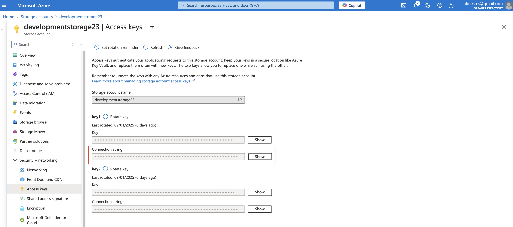
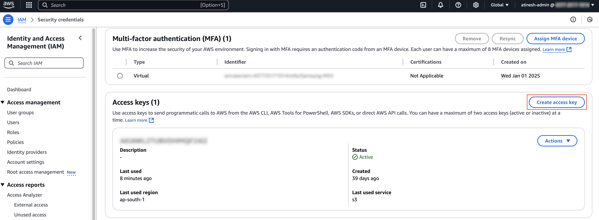

>Note: Before proceeding with the steps below, ensure you follow the instructions outlined in the [README.md](/README.md) file.

## 🛠️ Prerequisite

**Step 1**: Configure OpenAI key in `data_indexing/.env` environment file as follows.

```
openai_key=key
```

**Step 2**: Install [Python 3](https://www.python.org/downloads/) (`Python 3.11+`)

**Step 3**:  Create virtual environment and activate
```
$ pip install virtualenv
$ virtualenv genai-env
$ source genai-env/bin/activate
```

Now depending on the source (`Local`, `Azure` or `AWS`) follow any one of the below processes. 

## 💻 Local

Follow below steps to index local files.

**Step 1**: Install Dependencies
```
$ cd data_indexing
$ pip install -r requirements.txt
```

**Step 2**: Setup files

Put files to be indexed in `data_indexing/data` directory.

**Step 3**: Run Script

```
# python3 data_indexing.py <source> <local_directory_name> <index_name>
$ python3 data_indexing.py local data test_index_1
```

## 🌐 Azure

Follow below steps to index files stored in Azure blob containers.

**Step 1**: Install Dependencies
```
$ cd data_indexing
$ pip install -r requirements.txt
$ pip install azure-storage-blob
```

**Step 2**: Configure Azure credentials

1. Login to [Azure Portal](https://portal.azure.com/)
2. Go to Storage accounts section and select appropriate storage account.
3. In the left panel under `Security + networking` select `Access keys`. 
4. Configure `Connection string` in `data_indexing/.env` as follows.

```
az_connection_str="connection_string"
```



**Step 3**: Run Script

```
# python3 data_indexing.py <source> <container_name> <index_name>
$ python3 data_indexing.py azure rag-index test_index_1
```

## 🌐 AWS

Follow below steps to index files stored in AWS S3 bucket.

**Step 1**: Install Dependencies
```
$ cd data_indexing
$ pip install -r requirements.txt
$ pip install boto3
```

**Step 2**: Configure AWS credentials

1. Login to [AWS Console](https://aws.amazon.com/console/)
2. In the upper right corner of the console, choose your account name or number.
3. Choose `Security Credentials`. 
4. In the `Access keys` section, choose `Create access key`.
5. Configure `Access key` and `Secret access key` in `data_indexing/.env` as follows.

```
aws_access_key_id=access_key_id
aws_secret_access_key=secret_access_key
```



**Step 3**: Run Script

```
# python3 data_indexing.py <source> <bucket_name> <index_name>
$ python3 data_indexing.py aws rag-index22 test_index_1
```