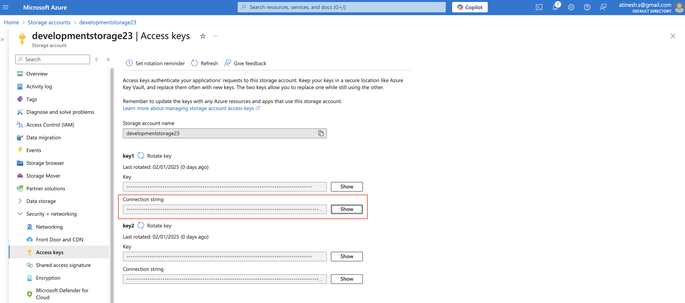
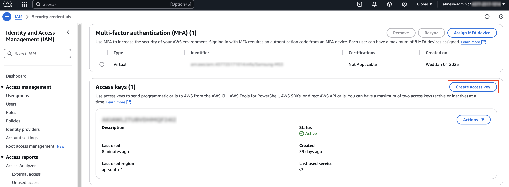

>Note: Before proceeding with the steps below, ensure you follow the instructions outlined in the [README.md](/README.md) file.

## 🛠️ Prerequisite

**Step 1**: Configure the project-root `.env`

```
OPENAI_API_KEY=sk-...
```

See [`.env.example`](/.env.example) for the full list including optional Azure/AWS credentials.

**Step 2**: Install [Python 3](https://www.python.org/downloads/) (`Python 3.11+`)

Now depending on the source (`Local`, `Azure` or `AWS`) follow any one of the below processes. 

## 💻 Local

Follow below steps to index local files.

**Step 1**: Put files to be indexed in the `data_indexing/corpus/` directory. Supported extensions: `.txt`, `.md`, `.pdf`, `.docx`, `.json`, `.csv`, `.xlsx`.

**Step 2**: Run Script

```
$ cd data_indexing
$ ./index_local.sh                              # uses defaults: corpus, test_index_1
$ ./index_local.sh corpus test_index_1          # explicit form
```

## 🌐 Azure

Follow below steps to index files stored in Azure blob containers.

**Step 1**: Configure Azure credentials in the root `.env`

1. Login to [Azure Portal](https://portal.azure.com/)
2. Go to Storage accounts section and select appropriate storage account.
3. In the left panel under `Security + networking` select `Access keys`. 
4. Add the connection string to the root-level `.env`:

```
AZURE_STORAGE_CONNECTION_STRING="connection_string"
```



**Step 2**: Run Script

```
$ cd data_indexing
$ ./index_azure.sh rag-index test_index_1
```

## 🌐 AWS

Follow below steps to index files stored in AWS S3 bucket.

**Step 1**: Configure AWS credentials in the root `.env`

1. Login to [AWS Console](https://aws.amazon.com/console/)
2. In the upper right corner of the console, choose your account name or number.
3. Choose `Security Credentials`. 
4. In the `Access keys` section, choose `Create access key`.
5. Add the keys to the root-level `.env` (these are the standard boto3 env vars, auto-detected by the SDK):

```
AWS_ACCESS_KEY_ID=access_key_id
AWS_SECRET_ACCESS_KEY=secret_access_key
AWS_DEFAULT_REGION=us-east-1
```



**Step 2**: Run Script

```
$ cd data_indexing
$ ./index_aws.sh rag-index22 test_index_1
```

## 🎛️ Configurations

In `data_indexing/data_indexing.py`:

| Setting | Default | What it does |
|---|---|---|
| `CHUNK_TOKENS` | `1200` | Target chunk size. |
| `CHUNK_OVERLAP_TOKENS` | `150` | Overlap between consecutive chunks (~12%). |
| `CSV_ROWS_PER_CHUNK` | `25` | Rows grouped into one chunk for CSV/XLSX. |
| `EMBEDDING_MODEL` | `text-embedding-3-large` | OpenAI embedding model. |
| `EMBEDDING_DIMENSIONS` | `3072` | Must match the embedding model. |

In the project-root `.env`:

| Env var | Default | What it does |
|---|---|---|
| `INDEX_TYPE` | `HNSW` | `HNSW` or `FLAT`. |
| `EF_RUNTIME` | `64` | HNSW: query-time candidates at index-creation time. |
